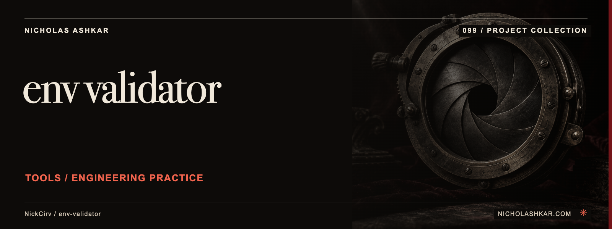

# env-validator

Validate environment values against a small text schema.


<a id="usage"></a>

<a id="schema-format"></a>

## What it does

Supports required values, types, bounds, enumerations and regex rules. diff compares schema keys; generate infers a draft schema. --all checks environment variants and --strict reports undeclared variables. See the pinned [implementation](https://github.com/NickCirv/env-validator/blob/6ca038bcd5d1cf15c7f6c1d6b6e11834daf3a67c/index.js).


<a id="install"></a>

## Quickstart

Node requirement from the inspected manifest: **`>=20`**. A positional path after generate writes the inferred schema; otherwise it prints output. Use the committed help/schema examples to author constraints.

The following example is **source-inspected, not executed**. It uses a pinned checkout; npm package publication is not assumed. Replace project paths or provide the stated input fixtures before running it.

```bash
git clone https://github.com/NickCirv/env-validator.git
cd env-validator
git checkout 6ca038bcd5d1cf15c7f6c1d6b6e11834daf3a67c
npm install --ignore-scripts
node index.js --file ../your-project/.env --schema ../your-project/.env.schema
```

Dependencies are installed with lifecycle scripts disabled in this recipe. Read the package scripts before enabling any lifecycle step required by your environment.

## Usage and reference

`env-validator` | `envv` are the executable names declared by the package. [Command reference](docs/REFERENCE.md) covers source-backed options and entry points.

| Control | Behavior in the inspected implementation |
| --- | --- |
| `--file PATH` | Choose the environment input |
| `--schema PATH` | Choose the custom text schema |
| `--strict` | Report undeclared variables |
| `generate` | Infer a draft schema |
| `diff` | Compare schema and environment keys |

## Limits and operational notes

Inference is based on current values and cannot recover all business constraints. This is a project-specific schema grammar, not JSON Schema or shell evaluation. Treat generated rules as a draft.

## Development

No runtime checks were executed for this documentation review. The committed smoke test checks entrypoint JavaScript syntax; it does not exercise the command behavior.

| Script | Declared command |
| --- | --- |
| `test` | `node --test` |

Work from the pinned source, keep changes focused, and reproduce the affected behavior with a small fixture before proposing a change. Existing contribution and security policies remain authoritative where present.

## Research and status

[Research record](docs/RESEARCH.md) identifies the inspected revision, source evidence, documentation disposition and verification gaps. Static inspection supports the descriptions here; runtime behavior, dependency installation and current hosted services remain unverified.

## License and author

[License](https://github.com/NickCirv/env-validator/blob/6ca038bcd5d1cf15c7f6c1d6b6e11834daf3a67c/LICENSE)

[Nicholas Ashkar](https://nicholashkar.com) · Applied AI, systems and consulting.
